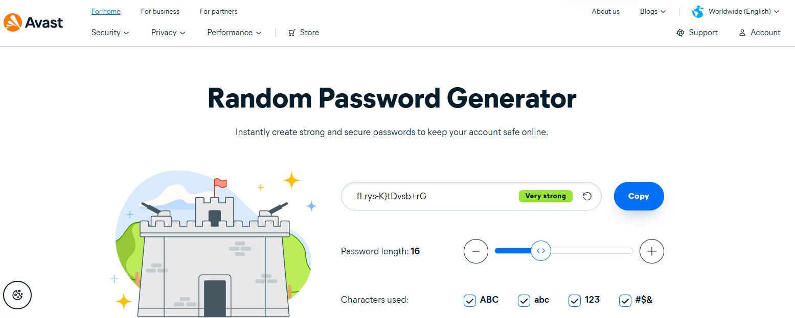
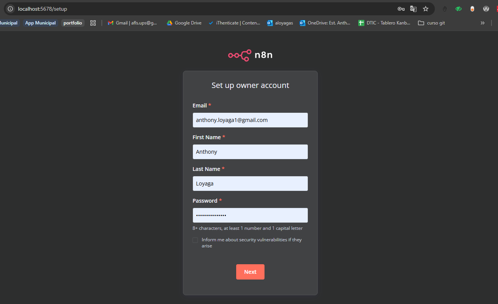
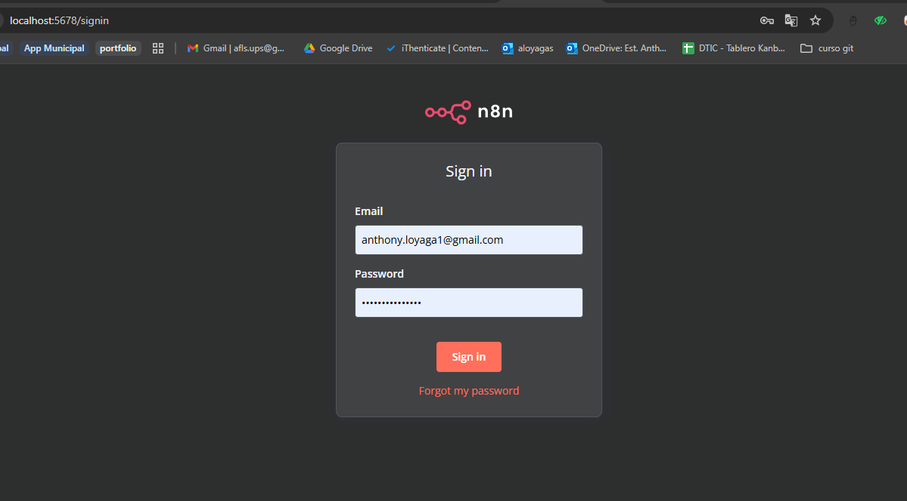
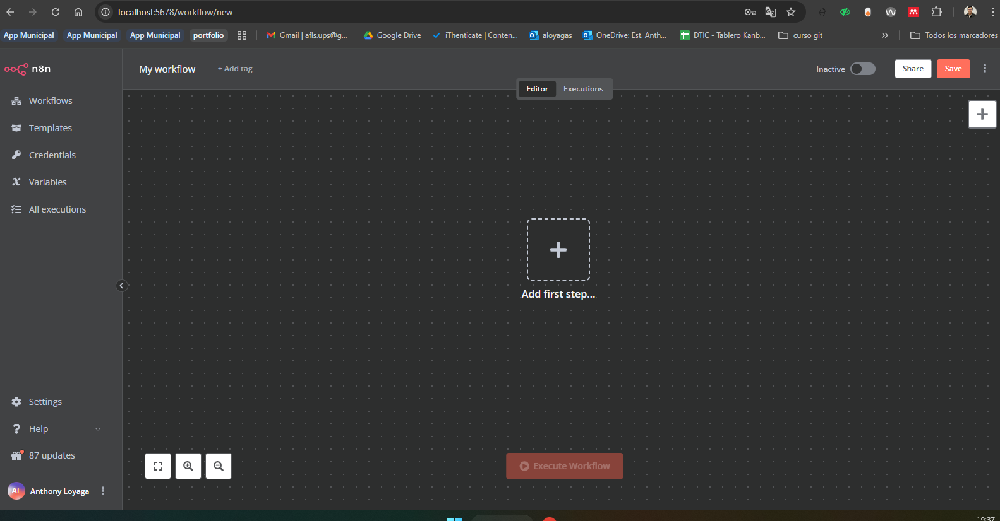

# N8N con Docker y PostgreSQL - Configuración Completa

Este proyecto configura una instancia de N8N con base de datos PostgreSQL utilizando Docker Compose, incluyendo autenticación básica y configuración segura.

## Grupo 5
- Roberto Maldonado
- David Saa
- Anthony Loyaga
- Nelson Lopez

## Generación de Contraseñas Seguras

Todas las contraseñas del archivo `.env` fueron generadas usando un generador de contraseñas seguro:

**Generador utilizado:** https://www.avast.com/random-password-generator#pc



## Estructura del Proyecto

```
├── docker-compose.yml     # Configuración de servicios Docker
├── .env                   # Variables de entorno (credenciales)
├── .gitignore            # Archivos excluidos del control de versiones
├── n8n_data/             # Datos persistentes de N8N
├── postgres_n8n_data/    # Datos persistentes de PostgreSQL
└── README.md             # Este archivo
```

## Configuración

### Variables de Entorno (.env)

```properties
# Configuración de PostgreSQL para n8n
N8N_DB_NAME=n8n_database
N8N_DB_USER=n8n_user
N8N_DB_PASSWORD=

# Configuración de autenticación para n8n
N8N_BASIC_AUTH_USER=admin_n8n
N8N_BASIC_AUTH_PASSWORD=
```

## Sistemas de Autenticación

### Importante: Basic Auth Deprecado

En versiones anteriores, al desplegar N8N en contenedores se configuraban **variables de ambiente** para habilitar **BASIC AUTH** como mecanismo de autenticación inicial.  

Desde **n8n 1.0+** (incluyendo la versión **1.15.1**), este método fue **deprecado** y reemplazado por un **sistema de gestión de usuarios** más seguro y robusto.

### Sistema de Autenticación Actual

#### **Owner Account** (Sistema Moderno de N8N)
- **Propósito**: Primera cuenta de administrador y sistema de usuarios integrado
- **Cuándo se configura**: En el primer acceso a N8N (proceso interactivo obligatorio)
- **Función**: Administrador principal de workflows, usuarios y configuraciones
- **Características**:
  - Sistema de usuarios completo
  - Gestión de permisos granular
  - Autenticación robusta
  - Posibilidad de múltiples usuarios

### Flujo de Autenticación Actual

1. **Navegador** → `http://localhost:5678`
2. **N8N carga** → Pantalla de configuración inicial (si es primera vez)
3. **Owner Account** → Configuración **obligatoria** del administrador principal:
   - Email
   - Nombre
   - Apellido
   - Contraseña
4. **N8N Dashboard** → Acceso completo a la aplicación

## Acceso a la Aplicación

1. **Iniciar servicios**
```bash
docker-compose up -d
```
1. **URL**: http://localhost:5678
2. **Primera vez**: Configuración **obligatoria** del Owner Account:
   - Email
   - Nombre
   - Apellido
   - Contraseña


3. **Accesos posteriores**: Login con las credenciales del Owner Account



4. **Dashboard inicial n8n**



## Comandos de Uso

### Iniciar servicios
```bash
docker-compose up -d
```

### Ver logs
```bash
docker-compose logs -f n8n
```

### Detener servicios
```bash
docker-compose down
```

### Reiniciar servicios
```bash
docker-compose restart
```

## Servicios Incluidos

### N8N
- **Puerto**: 5678
- **Versión**: 1.15.1
- **Base de datos**: PostgreSQL
- **Autenticación**: Sistema de usuarios integrado (Owner Account)

### PostgreSQL
- **Puerto**: 5432 (interno)
- **Versión**: 15
- **Base de datos**: n8n_database
- **Usuario**: n8n_user


## Notas Importantes

- **Backup**: Los datos se almacenan en `n8n_data/` y `postgres_n8n_data/`
- **Seguridad**: Nunca exponer el archivo `.env` en repositorios públicos
- **Producción**: Considerar autenticación más robusta (OAuth, SSO)
- **Red**: Los servicios se comunican a través de `n8n_network`

